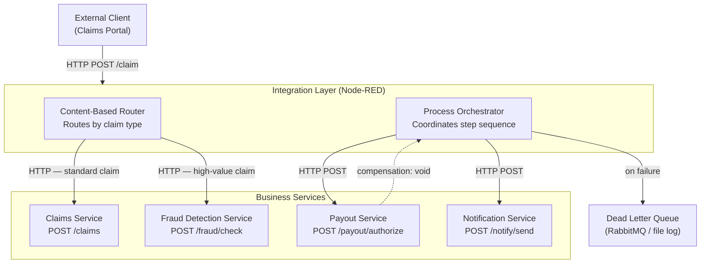
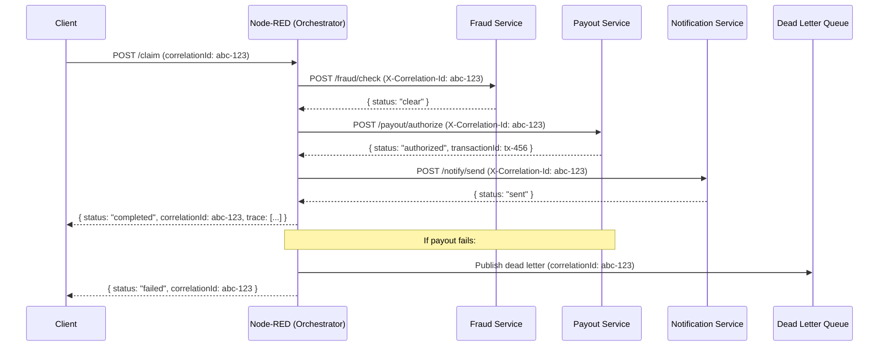

# Example: What a Good System Context Diagram Includes

This file shows the **expected content and structure** of a System Context Diagram — not the answer for the capstone scenario. The example below uses a fictional **Insurance Claims Processing** domain so it does not give away your solution.

Place your own diagrams in the `docs/` folder (or inline them in your README as Mermaid blocks).

---

## What a System Context Diagram Must Show

A System Context Diagram answers the question: **"What systems exist, and how do they communicate?"**

It must include:
- Every service/system (show each as a named box)
- The integration layer prominently labeled (it is NOT just another service — it is the bus)
- Direction of communication on each arrow (→ not just lines)
- Protocol or channel type on each arrow (HTTP, AMQP, file, etc.)
- The external client or trigger (who starts the process)
- Error paths or DLQ connections (even if dashed)

---

## Example (Mermaid — Insurance Claims Domain)



---

## Example (Mermaid — Integration Architecture Diagram)

The Integration Architecture Diagram is more detailed — it shows message flows, failure paths, and where each EAI pattern is applied.



---

## Accepted Diagram Formats

You may submit diagrams in any of these formats:

| Format | How to include |
|---|---|
| Mermaid | Inline in README.md as a ` ```mermaid ` code block |
| PNG / JPG | Commit to `docs/` folder and reference in README |
| PDF | Commit to `docs/` folder and reference in README |
| draw.io (.drawio) | Commit to `docs/` folder — can be opened at draw.io |

**Minimum requirement:** All three required diagrams must be readable and complete. Placeholder images or empty boxes will receive 0 points on the relevant criterion.

---

## Common Diagram Mistakes

| Mistake | Problem |
|---|---|
| Node-RED shown as just another service box | The integration layer must be architecturally distinct — it coordinates others |
| Arrows without labels | Cannot tell what protocol or data is flowing |
| Missing error paths | A diagram with only the happy path is incomplete |
| Direct arrows between business services | Violates the no-direct-coupling principle |
| Client arrow going directly to a business service | Bypasses the integration layer |
